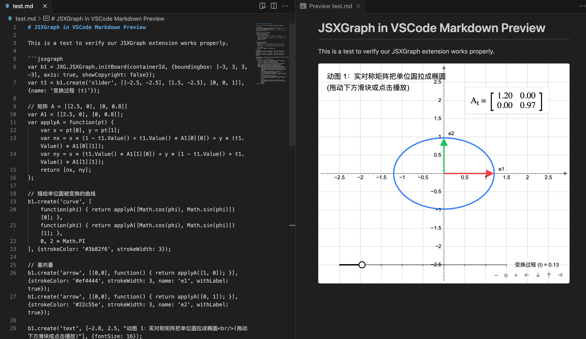

# Markdown Preview JSXGraph Support

Render interactive [JSXGraph](https://jsxgraph.org/) mathematical visualizations directly inside your VSCode Markdown Preview.



## Features

- **Native Integration**: Seamlessly renders `jsxgraph` fenced code blocks in Markdown.
- **Interactive**: Full support for mouse dragging, wheel zooming, and touch interactions.
- **Responsive**: Auto-scales to the width of your preview window.
- **Smart Auto-Fit**: Automatically adjusts the viewport to show all elements with perfect padding.
- **Smooth Zoom**: Optimized scroll sensitivity for a premium exploration experience.
- **Offline Capable**: Bundles JSXGraph core locally; no external CDN required.

## Usage

Create a fenced code block with the language `jsxgraph`. Within the block, use the provided `containerId` to initialize your board.

When calling `JXG.JSXGraph.initBoard` please use inner `containerId` variable.

```jsxgraph
var board = JXG.JSXGraph.initBoard(containerId, {
    boundingbox: [-5, 5, 5, -5],
    axis: true,
    showCopyright: false
});

var p1 = board.create('point', [-2, 2], { name: 'A', size: 4 });
var p2 = board.create('point', [3, -1], { name: 'B', size: 4 });
var line = board.create('line', [p1, p2], { strokeColor: 'blue' });
```

## Configuration Defaults

By default, the following settings are injected to ensure a great interactive experience out of the box:
- `pan: { enabled: true, needShift: false }`
- `zoom: { enabled: true, wheel: true, factor: 1.05 }`
- `board.zoomFit()` is automatically called after initialization to center your content.

## License

This extension is licensed under the [MIT License](LICENSE).
JSXGraph itself is dual-licensed under [LGPL-3.0-or-later OR MIT](https://github.com/jsxgraph/jsxgraph/blob/master/LICENSE).
